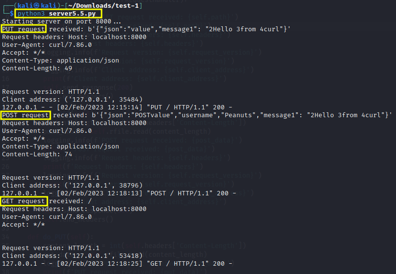

# POST-GET-server
Python3 HTTP server to get log POST and GET requests

>Place index.html file in folder where the Python server will be started.  

```bash
python3 server5.5.py
```  
  
>Embedding a tracking pixel in phishing email can provide additional information about victim targeted.  

```html
    
```   

>Sample Curl commands to test the Python HTTP server logging requests:  

```bash
curl -X PUT -H "Content-Type: application/json" -d '{"json":"value","message1": "2Hello 3from 4curl"}' http://localhost:8000
```  

```bash
curl -X POST -H "Content-Type: application/json" -d '{"json":"value","message1": "2Hello 3from 4curl"}' http://localhost:8000
```  

```bash
curl http://localhost:8000
```  

  
